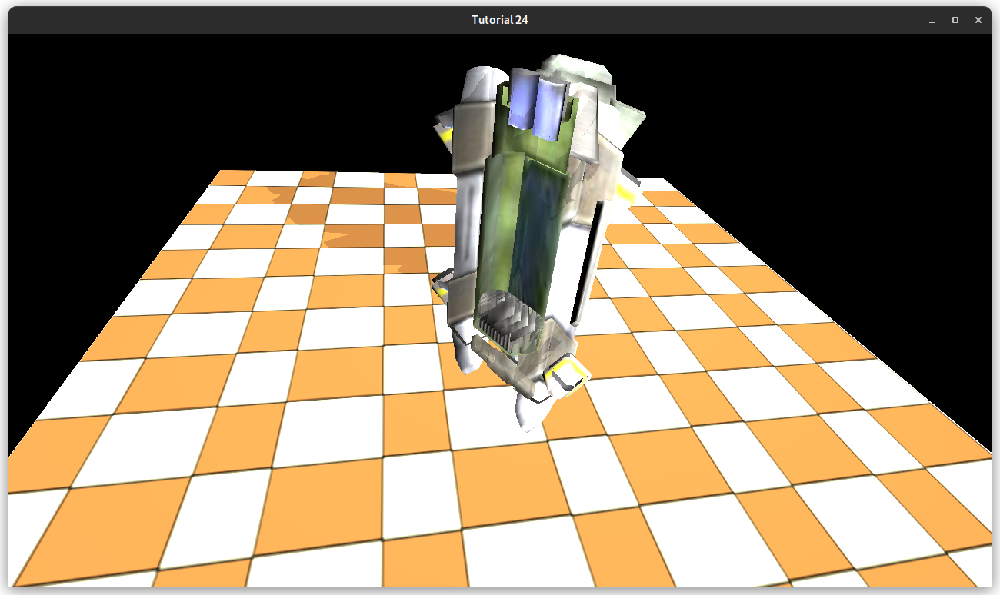
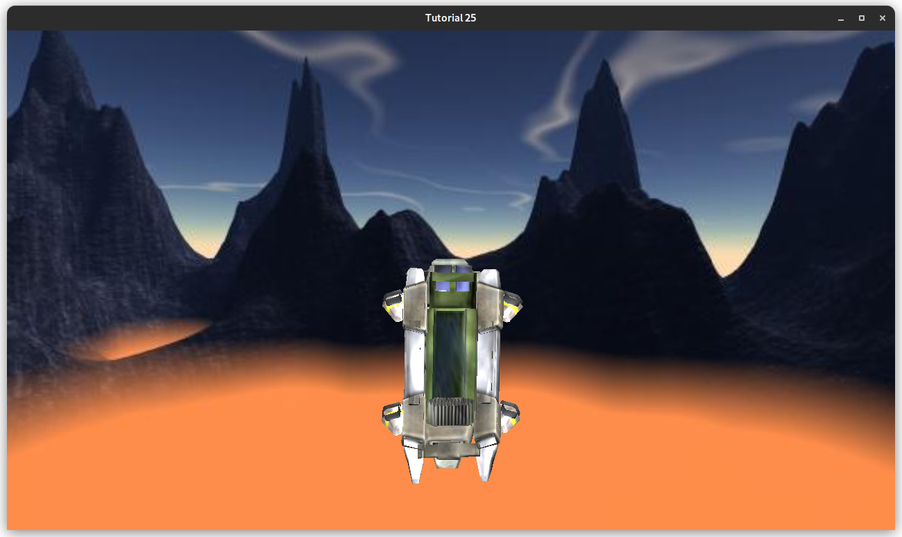
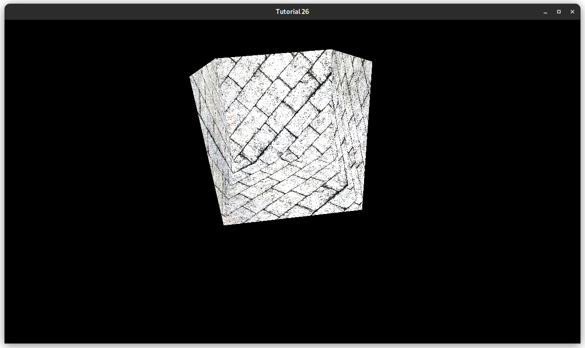

# CG LAB 5

Пятая лабораторная работа по компьютерной графике.

## Выполнено:

### Работа с тенью

ShadowMapFBO:

```c++
class ShadowMapFBO {
    public:
    ShadowMapFBO();

    ~ShadowMapFBO();

    bool init(unsigned int windowWidth, unsigned int windowHeight);

    void bindForWriting() const;

    void bindForReading(GLenum textureUnit) const;

    private:
    GLuint mFBO;
    GLuint mShadowMap;
};
```

ShadowTechnique:

```c++
class ShadowMapTechnique : public Technique {
    public:
    ShadowMapTechnique(std::string vertexShaderFilename,
                       std::string fragmentShaderFilename);

    bool init() override;

    void setWVP(const glm::mat4& wvp) const;

    void setTextureUnit(unsigned int textureUnit) const;

    private:
    std::string mVertexShaderFilename;
    std::string mFragmentShaderFilename;

    GLint mWVPLocation;
    GLint mTextureLocation;
};
```

shadow_vertex:

```glsl
#version 330

layout (location = 0) in vec3 Position;
layout (location = 1) in vec2 TexCoord;
layout (location = 2) in vec3 Normal;

uniform mat4 gWVP;

out vec2 TexCoordOut;

void main()
{
    gl_Position = gWVP * vec4(Position, 1.0);
    TexCoordOut = TexCoord;
}
```

shadow_fragment:
```glsl
#version 330

in vec2 TexCoordOut;
uniform sampler2D gShadowMap;

out vec4 FragColor;

void main()
{
    float Depth = texture(gShadowMap, TexCoordOut).x;
    Depth = 1.0 - (1.0 - Depth) * 25.0;
    FragColor = vec4(Depth);
}   
```

light_fragment:
```glsl
uniform sampler2D gShadowMap;

float calcShadowFactor(vec4 LightSpacePos) {
    vec3 ProjCoords = LightSpacePos.xyz / LightSpacePos.w;

    vec2 UVCoords;
    UVCoords.x = 0.5 * ProjCoords.x + 0.5;
    UVCoords.y = 0.5 * ProjCoords.y + 0.5;

    float z= 0.5 * ProjCoords.z + 0.5;

    float Depth = texture(gShadowMap, UVCoords).x;
    if (Depth < (z + 0.00001))
    return 0.5;
    else
    return 1.0;
}
```

light_vertex:
```glsl
uniform mat4 gLightWVP;

void main() {
    ...
    LightSpacePos = gLightWVP * vec4(Position, 1.0);
    ...
}
```

Результат:


### Создание скайбокса

Skybox:
```c++
class Skybox {
    public:
        Skybox(std::shared_ptr<const Camera> camera, const PersProjInfo& persProjInfo);

        ~Skybox();

        bool init(const std::string& directory,
                  const std::string& posXFilename,
                  const std::string& negXFilename,
                  const std::string& posYFilename,
                  const std::string& negYFilename,
                  const std::string& posZFilename,
                  const std::string& negZFilename);

        void render();

    private:
        std::unique_ptr<SkyboxTechnique> mSkyboxTechnique;
        std::shared_ptr<const Camera> mCamera;
        std::unique_ptr<CubemapTexture> mCubemapTex;
        std::unique_ptr<Mesh> mMesh;
        PersProjInfo mPersProjInfo;
};
```

SkyboxTechnique:
```c++
class SkyboxTechnique : public Technique {
    public:
        SkyboxTechnique(
            std::string vertexShaderFilename, std::string fragmentShaderFilename
        );

        ~SkyboxTechnique();

        bool init() override;

        void setWVP(const glm::mat4& wvp) const;

        void setTextureUnit(GLint textureUnit) const;

    private:
        std::string mVertexShaderFilename;
        std::string mFragmentShaderFilename;

        GLint mWVPLocation;
        GLint mTextureLocation;
};
```

CubemapTexture:
```c++
class CubemapTexture {
    public:
        CubemapTexture(
            const std::string& directory,
            const std::string& poxXFilename,
            const std::string& negXFilename,
            const std::string& posYFilename,
            const std::string& negYFilename,
            const std::string& posZFilename,
            const std::string& negZFilename
        );

        ~CubemapTexture();

        bool load();

        void bind(GLenum textureUnit) const;

    private:
        std::vector<std::string> mFilenames;
        GLuint mTextureObj;
};
```

skybox_vertex:
```glsl
#version 330

layout (location = 0) in vec3 Position;

uniform mat4 gWVP;

out vec3 TexCoord0;

void main() {
    vec4 WVP_Pos = gWVP * vec4(Position, 1.0);

    gl_Position = WVP_Pos.xyww;

    TexCoord0 = Position;
}
```

skybox_fragment:
```glsl
#version 330

in vec3 TexCoord0;

out vec4 FragColor;

uniform samplerCube gCubemapTexture;

void main() {
    FragColor = texture(gCubemapTexture, TexCoord0);
}
```

Результат:


### Работа с нормалями

light_fragment:

```glsl
vec3 CalcBumpedNormal() {
    vec3 Normal = normalize(Normal0);
    vec3 Tangent = normalize(Tangent0);
    Tangent = normalize(Tangent - dot(Tangent, Normal) * Normal);
    vec3 Bitangent = cross(Tangent, Normal);

    vec3 BumpMapNormal = texture(gNormalMap, TexCoord0).xyz;
    BumpMapNormal = 2.0 * BumpMapNormal - vec3(1.0, 1.0, 1.0);

    vec3 NewNormal;
    mat3 TBN = mat3(Tangent, Bitangent, Normal);
    NewNormal = TBN * BumpMapNormal;
    NewNormal = normalize(NewNormal);
    return NewNormal;
}
```

Результат:
